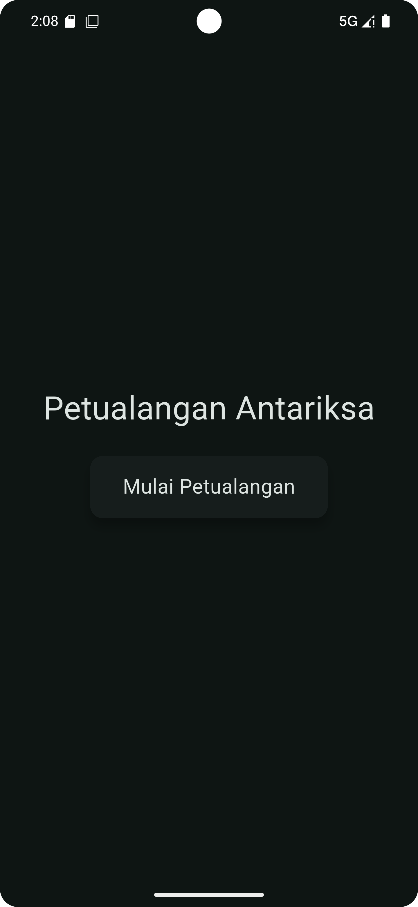
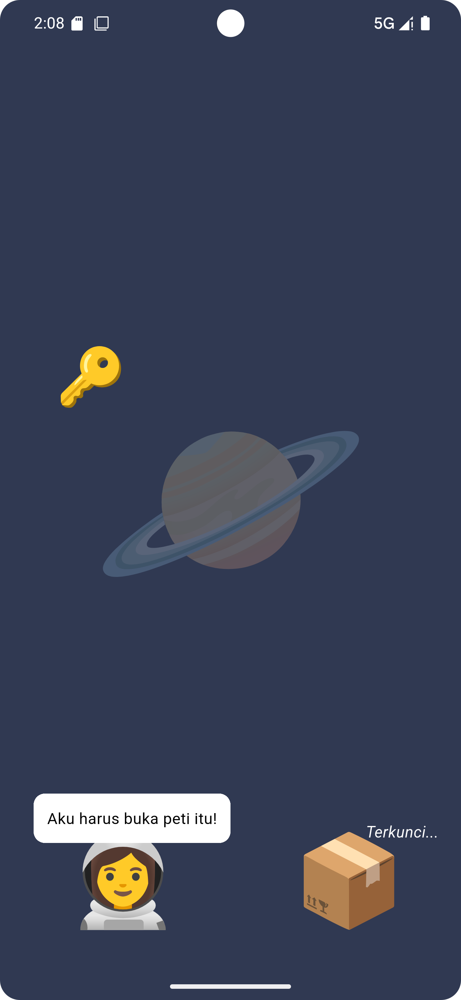
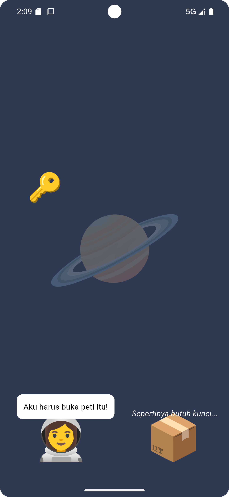
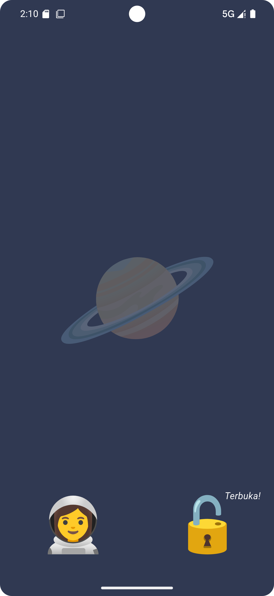
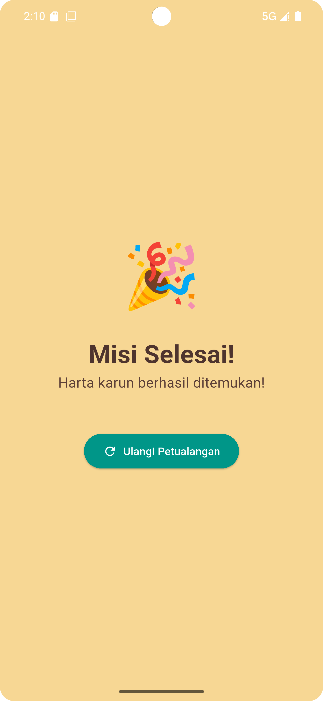

# Gesture Buku Cerita

Project ini berisi tentang cara membangun aplikasi buku cerita digital sederhana dengan 3 halaman. Halaman
utamanya adalah sebuah adegan di planet asing di mana pengguna harus menggunakan
berbagai gestur untuk membantu seorang astronaut membuka peti harta karun.


## Praktik
### 1. Pertama buat new flutter project


### 2. Lalu buka code editor

  
### 3. Buat folder pages berisi 3 halaman:
- title_page.dart
- scene_page.dart
- end_page.dart


### 4. Ubah main.dart untuk membuat struktur PageView


```
import 'package:flutter/material.dart';
import 'package:storybook_practicum/pages/scene_page.dart';
import 'package:storybook_practicum/pages/title_page.dart';
import 'package:storybook_practicum/pages/end_page.dart';
void main() {
  runApp(const MyApp());
}
class MyApp extends StatelessWidget {
  const MyApp({super.key});
  @override
  Widget build(BuildContext context) {
    return MaterialApp(
      title: 'Interactive Storybook',
      theme: ThemeData(
        colorScheme: ColorScheme.fromSeed(seedColor: Colors.teal,
            brightness: Brightness.dark),
        useMaterial3: true,
      ),
      home: StorybookHome(),
      debugShowCheckedModeBanner: false,
    );
  }
}

class StorybookHome extends StatelessWidget {
  StorybookHome({super.key});
  final PageController _controller = PageController();
  @override
  Widget build(BuildContext context) {
    return Scaffold(
      body: PageView(
        controller: _controller,
        children: [
          TitlePage(onStartPressed: () =>
              _controller.animateToPage(1, duration: const
              Duration(milliseconds: 400), curve: Curves.easeInOut)),
          InteractiveScenePage(onQuestComplete: () =>
              _controller.animateToPage(2, duration: const
              Duration(milliseconds: 400), curve: Curves.easeInOut)),
          EndPage(onRestart: () => _controller.animateToPage(0,
              duration: const Duration(milliseconds: 400), curve:
              Curves.easeInOut)),
        ],
      ),
    );
  }
}
```

### 5. Isi setiap file di folder pages dengan StatelessWidget boilerplate sederhana. Contoh untuk title_page.dart


```
import 'package:flutter/material.dart';
class TitlePage extends StatelessWidget {
  final VoidCallback onStartPressed;
  const TitlePage({super.key, required this.onStartPressed});
  @override
  Widget build(BuildContext context) {
    return Scaffold(
        body: Center(
          child: Column(
            mainAxisAlignment: MainAxisAlignment.center,
            children: [
              const Text("Petualangan Antariksa", style: TextStyle(fontSize: 32)),
              const SizedBox(height: 20),
              ElevatedButton(onPressed: onStartPressed, child: const Text("Mulai")),
            ],
          ),
        ),
    );
  }
}

```

### 6. Lakukan hal yang sama untuk scene_page.dart dan end_page.dart, cukup tampilkan teks judul halaman

### 7. Fokus pada lib/pages/scene_page.dart → ganti isinya dengan kerangka StatefulWidget


```
import 'package:flutter/material.dart';
class InteractiveScenePage extends StatefulWidget {
  final VoidCallback onQuestComplete;
  const InteractiveScenePage({super.key, required
  this.onQuestComplete});
  @override
  State<InteractiveScenePage> createState() =>
      _InteractiveScenePageState();
}
class _InteractiveScenePageState extends
State<InteractiveScenePage> {
  // Variabel state untuk posisi, dialog, dan status peti
  Offset _keyPosition = const Offset(50, 300);
  bool _isDialogueVisible = false;
  bool _isChestOpen = false;
  String _chestHint = "Terkunci...";

  // GlobalKeys untuk mendapatkan posisi dan ukuran widget
  final GlobalKey _chestKey = GlobalKey();

  @override
  Widget build(BuildContext context) {
    return Scaffold(
      body: Stack(
        children: [
          // Latar Belakang
          Container(color: const Color(0xff303952), child: const
          Center(child: Text("🪐", style: TextStyle(fontSize: 200, color: Colors.white24)))),
          // Elemen-elemen adegan akan kita tambahkan di sini
        ],
      ),
    );
  }
}
```

### 8. Tambahkan Astronaut & Balon Dialog (Double Tap). Di dalam Stack, tambahkan Positioned untuk astronaut


```
          // Astronaut (Double Tap)
          Positioned(
            bottom: 50,
            left: 60,
            child: GestureDetector(
              onDoubleTap: () {
                setState(() {
                  _isDialogueVisible = !_isDialogueVisible;
                });
              },
              child: const Text("👩‍🚀", style: TextStyle(fontSize: 80)),
            ),
          ),
          // Balon Dialog
          if (_isDialogueVisible)
            Positioned(
              bottom: 140,
              left: 30,
              child: Container(
                padding: const EdgeInsets.all(12),
                decoration: BoxDecoration(color: Colors.white,
                    borderRadius: BorderRadius.circular(10)),
                child: const Text("Aku harus buka peti itu!", style: TextStyle(color: Colors.black)),
              ),
            ),
```

### 9. Tambahkan Peti & Petunjuk (Long Press). Di dalam Stack, tambahkan Positioned untuk peti.


```
// Peti (Long Press)
          Positioned(
            key: _chestKey, // Memberi kunci global pada peti
            bottom: 50,
            right: 50,
            child: GestureDetector(
              onLongPress: () {
                if (_isChestOpen) return;
                setState(() {
                  _chestHint = "Sepertinya butuh kunci...";
                });
                // Menghilangkan petunjuk setelah beberapa detik
                Future.delayed(const Duration(seconds: 2), () => setState(() => _chestHint = "Terkunci..."));
              },
              child: Text(_isChestOpen ? "🔓" : "📦", style:
              TextStyle(fontSize: 80)),
            ),
          ),
          // Teks Petunjuk Peti
          Positioned(
            bottom: 140,
            right: 20,
            child: Text(_chestHint, style: const TextStyle(color:
            Colors.white, fontStyle: FontStyle.italic)),
          ),
```

### 10. Tambahkan Kunci & Logika Drag-and-Drop. Di dalam Stack, tambahkan Positioned untuk kunci.


```
          // Kunci (Drag & Drop)
          Positioned(
            left: _keyPosition.dx,
            top: _keyPosition.dy,
            child: GestureDetector(
              onPanUpdate: (details) {
                if (_isChestOpen) return; // Kunci tidak bisa digerakkan jika peti sudah terbuka
                setState(() {
                  _keyPosition += details.delta;
                });
              },
              onPanEnd: (details) {
                if (_isChestOpen) return;

                // Cek apakah kunci di-drop di atas peti
                final RenderBox chestBox = _chestKey.currentContext!.findRenderObject() as RenderBox;
                final chestPosition = chestBox.localToGlobal(Offset.zero);
                final chestRect = chestPosition & chestBox.size;
                if (chestRect.contains(_keyPosition)) {
                  setState(() {
                    _isChestOpen = true;
                    _chestHint = "Terbuka!";
                    // Sembunyikan kunci
                    _keyPosition = const Offset(-100, -100);
                  });
                  // Pindah ke halaman akhir setelah quest selesai
                  Future.delayed(const Duration(seconds: 2), widget.onQuestComplete);
                }
              },
              child: const Text("🔑", style: TextStyle(fontSize: 50)),
            ),
          )
```

### 11. Hot Reload & Uji Coba: Coba semua interaksi: double tap astronaut, long press peti, dan geser kunci ke peti.


### 12. Efek Visual (InkWell) → Buka lib/pages/title_page.dart

### 13. Bungkus ElevatedButton dengan Card dan InkWell untuk efek yang lebih bagus. Ganti ElevatedButton dengan kode berikut:


```
              // Di dalam title_page.dart, ganti ElevatedButton dengan ini:
              Card(
                elevation: 8,
                child: InkWell(
                  onTap: onStartPressed,
                  splashColor: Colors.teal.withAlpha(40),
                  child: const Padding(
                    padding: EdgeInsets.symmetric(horizontal: 32.0, vertical:
                    16.0),
                    child: Text("Mulai Petualangan", style: TextStyle(fontSize:
                    20)),
                  ),
                ),
              ),
```

### 14. Kita akan membuat latar belakang bisa digeser sedikit secara horizontal atau vertikal (seperti melihat lewat teleskop), tapi tidak keduanya sekaligus.

### 15. Kembali ke lib/pages/scene_page.dart

### 16. Kita modifikasi Container latar belakang. Pertama, tambahkan Offset untuk posisi background di State

```
// Tambahkan variabel state baru
  Offset _backgroundOffset = Offset.zero;
```

### 17. Bungkus Container latar belakang dengan RawGestureDetector dan Transform


```
Transform.translate(
            offset: _backgroundOffset,
            child: RawGestureDetector(
              gestures: <Type, GestureRecognizerFactory>{
                HorizontalDragGestureRecognizer:
                GestureRecognizerFactoryWithHandlers<HorizontalDragGestureRecognizer>(
                      () => HorizontalDragGestureRecognizer(),
                      (instance) {
                    instance.onUpdate = (details) {
                      setState(() {
                        // Batasi pergerakan agar tidak terlalu jauh
                        _backgroundOffset += Offset(details.delta.dx, 0);
                      });
                    };
                  },
                ),
                VerticalDragGestureRecognizer:
                GestureRecognizerFactoryWithHandlers<VerticalDragGestureRecognizer>(
                      () => VerticalDragGestureRecognizer(),
                      (instance) {
                    instance.onUpdate = (details) {
                      setState(() {
                        _backgroundOffset += Offset(0, details.delta.dy);
                      });
                    };
                  },
                ),
              },
              child: Container(
                width: MediaQuery.of(context).size.width * 1.2, // Buat BG lebih besar agar ada ruang gerak
                height: MediaQuery.of(context).size.height * 1.2,
                color: const Color(0xff303952),
                child: const Center(
                  child: Text("🪐", style: TextStyle(fontSize: 200, color: Colors.white24)),
                ),
              ),
            ),
          ),
```

### 18. Ujicoba: Coba geser latar belakang. Kalian hanya bisa menggesernya di satu sumbu (horizontal atau vertikal) dalam satu waktu.

### 19. Fungsionalitas Zoom dengan InteractiveViewer

### 20. Di lib/pages/scene_page.dart, bungkus seluruh Stack dengan widget InteractiveViewer


```
return Scaffold(
      body: InteractiveViewer( // <--- WIDGET DITAMBAHKAN DI SINI
        boundaryMargin: const EdgeInsets.all(double.infinity),
        minScale: 1.0,
        maxScale: 3.0,
        child: Stack(
          children: [
            // ... semua widget di dalam Stack tetap sama ...
          ],
        ),
      ),
    );
  }
}
```

### 21. Hot Reload dan seluruh adegan interaktif bisa di-zoom dan di-pan dengan mudah





